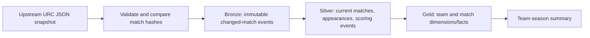

# Rugby Analytics Lakehouse

**Question:** What can match and player scoring data tell us about team performance across a United Rugby Championship season?

This portfolio project starts with a reproducible local pipeline for the 2024–25 rugby union season. It tracks source corrections at match level and produces team-season metrics. Bronze, Silver, and Gold Delta tables have also been built on Databricks Free Edition. A repeated ingestion added no match versions, and the Gold totals reconciled with the current matches. dbt, Airflow, and Azure work remains in progress; see [`cloud/`](cloud/README.md).

## What works now



The local reference implementation uses Python and SQLite so the incremental and correction-handling logic can be run without cloud credentials. It writes changed source records to JSONL files under `data/bronze/`, keeps an append-only event history in SQLite, and replaces affected current-state records. A repeated identical snapshot makes no changes.

## Source and scope

- Source: [transientlunatic/Rugby-Data](https://github.com/transientlunatic/Rugby-Data), `json/celtic-2024-2025.json`, fetched at run time. The upstream project describes its JSON as professional rugby union scoring data. The [source audit](docs/source-audit.md) records the observed file version, fingerprint, and reuse status. No upstream dataset is committed here.
- Coverage: one URC season. Player analysis currently covers lineup appearances and scoring events, not tackles, carries, or full performance statistics.
- The upstream file is a **snapshot**, not an event feed. Incremental ingestion compares each match's content hash with the latest processed version. This detects late score and lineup corrections when the source is fetched again.
- The source does not publish a fixture ID in this file. The pipeline derives one from competition, season, phase, round, and both teams. A change to one of those identity fields is treated as a new fixture and needs manual reconciliation.

## Run locally

Requirements: Python 3.10+ and internet access for the first sync.

```bash
python -m pip install -e '.[dev]'
rugby-lakehouse sync
rugby-lakehouse summary
rugby-lakehouse quality
python -m pytest -q
```

For an offline input file, use `rugby-lakehouse sync --input path/to/matches.json`. Generated data stays in the ignored `data/` directory. Re-run `sync` to check for corrections; compare `changed_matches` between runs.

For a fixed upstream version, use `rugby-lakehouse sync --source-ref c2de981ddcbcf2362fdc5719eefa6d9172740850`. The default `master` ref checks for later source corrections.

To prepare a validated JSONL file for a manual Databricks Free Edition upload, run `rugby-lakehouse prepare-landing --source-ref c2de981ddcbcf2362fdc5719eefa6d9172740850`. The ignored landing filename includes the season and a snapshot hash, such as `data/landing/urc-2024-25-47ce925d0db9.jsonl`. This preserves distinct snapshots when upstream corrects the same season. See the [Free Edition setup](cloud/free-edition/README.md) for the verified ingestion and Gold runs.

## Data model

| Layer | Tables / files | Purpose |
| --- | --- | --- |
| Bronze | `bronze_event`, `data/bronze/*.jsonl` | Immutable match versions with ingestion time and source hash |
| Silver | `silver_match`, `silver_player_appearance`, `silver_scoring_event` | Validated current records and flattened child entities |
| Gold | `dim_team`, `fact_match`, `gold_team_season` | Match facts and team-level season totals |

Gold computes played, wins, draws, points for, and points against from the current Silver state. These are descriptive results; the pipeline does not claim causal player-performance conclusions.

## Engineering choices and checks

- Validate required fields, distinct teams, nonnegative scores, and unique fixture keys before writing.
- Keep prior source versions in Bronze and upsert the latest version into Silver. On correction, replace the fixture's player and scoring rows, then refresh Gold in one database transaction.
- Use content hashes for idempotence. The tests exercise repeat ingestion, a late score/date correction, malformed input, and duplicate fixture keys.
- Normalize penalty tries to seven points before reconciling scoring events with final scores. The upstream event's `value` is five, while its final score includes the automatic two points. Keep the raw value in Bronze and the normalized value in Silver. A transform version makes existing local databases reprocess the same source snapshot when this rule changes.
- Use parameterized SQL and keep credentials out of the repository.

### Observed run

On 28 September 2026, the upstream 2024–25 snapshot contained 151 fixtures and 16 teams. The pipeline produced 6,946 player appearances and 2,396 scoring events. A repeated run found zero changed matches. An audit found 16 apparent score discrepancies, all explained by one penalty try per affected fixture; after normalization, the quality report has zero score discrepancies. Team totals use the final scores. See the [source audit](docs/source-audit.md) for the evidence and limitations.

## Cloud roadmap

The no-cost development path uses Databricks Free Edition managed storage and a local upload. The Azure storage integration below remains a separate deployment draft because the available Free Edition workspace is hosted on AWS.

1. Run and test the dbt models against the same Silver tables.
2. Publish a small dashboard with team and player scoring questions.
3. Deploy the Airflow DAG and Azure storage integration when a compatible, affordable workspace is available, then add run observability.

The local pipeline provides a testable contract for that migration. Remaining cloud components and the dashboard will be marked implemented only after they run.

