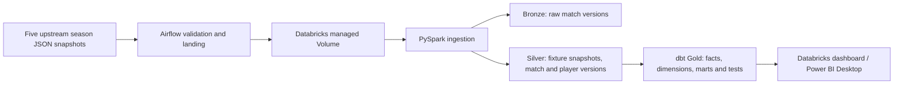

# Rugby Analytics Lakehouse

**Question:** How do fixtures, teams, player scoring and team performance change across five United Rugby Championship seasons?

This is the flagship data engineering project in the portfolio. The local reference pipeline has processed the 2021–22 through 2025–26 `celtic` JSON snapshots. It keeps raw versions, models current fixtures separately from completed results, handles source corrections, and produces team-season metrics. The five-season Databricks Silver ingestion and dbt Gold build have now been run and reconciled in the Free Edition workspace. Airflow orchestration and Power BI reporting remain to be deployed.

## Architecture



The supported no-cost development path uses a Databricks Free Edition managed Volume as cloud storage, serverless Delta tables, local dbt Core and Power BI Desktop. PySpark owns Bronze and Silver; dbt owns Gold. The separate Gold notebook is a comparison implementation, not a required pipeline step. The Airflow DAG is a deployment draft and has **not** run in an Airflow instance yet. The available Free Edition workspace is on AWS; the older Azure ADLS script under `cloud/databricks/` is an alternative draft, not part of this verified path. See [cloud setup](cloud/README.md).

## Source and scope

- Source: [transientlunatic/Rugby-Data JSON](https://github.com/transientlunatic/Rugby-Data/tree/master/json), files `celtic-2021-2022.json` through `celtic-2025-2026.json`. The [five-season audit](docs/multiseason-audit.md) records hashes, coverage and known data gaps. No upstream dataset is committed.
- All five files contain 151 fixture rows. The latest available 2025–26 snapshot has 84 scored results and 67 fixtures with no result. Their dates have passed, so the project calls them **result unavailable in source** rather than upcoming games.
- Player coverage means lineup appearances and listed scoring events. The source does not support claims about tackles, carries or complete individual performance.
- The source is a snapshot, not a change feed. Each match and each whole-season snapshot has a content hash. Re-reading an identical snapshot creates no new match version. A corrected score or lineup creates a new version; Bronze preserves the older raw record.
- The source does not publish a fixture ID. For named teams, the key uses competition, season, phase, round and teams. `TBC` fixtures use a temporary source-position key; a later named result replaces the placeholder in the current season snapshot.

## Run locally

Requires Python 3.10+. From the repository root:

```bash
python -m pip install -e '.[dev]'
rugby-lakehouse sync --all-seasons
rugby-lakehouse quality
rugby-lakehouse summary --season 2024-25
python -m pytest -q
```

`sync --all-seasons` fetches the five audited historical files. Use `--season 2025-26` to process one season, or `--input path/to/celtic-2025-2026.json --season 2025-26` for an offline file. A future consecutive season such as `2026-27` works with `--season 2026-27` when its upstream file exists. Generated data is ignored under `data/`. Re-run `sync`; `changed_matches` should be zero when source contents are unchanged.

Prepare the managed-Volume uploads with `rugby-lakehouse prepare-landing --all-seasons`, or use `--season YYYY-YY` for a weekly update. Each JSONL line contains the unchanged upstream `raw` record and the normalized `match` record. The filename includes season, transform version and a snapshot hash, so a changed upstream file creates a new landing name. The [folder ingestion notebook](cloud/free-edition/ingest_folder_notebook.py) discovers and processes new snapshots without changing a widget for each file. See the [manual Free Edition guide](cloud/free-edition/README.md).

## Model and checks

| Layer | Local tables / cloud equivalents | Purpose |
| --- | --- | --- |
| Bronze | `bronze_event` / `bronze_match_versions` | Raw changed records and source hashes |
| Silver | `silver_fixture`; match, appearance and event tables / Delta version tables and season manifest | Current fixture snapshots and completed match detail |
| Gold | `dim_team`, `fact_match`, `gold_team_season` / dbt marts including `team_match` and `scoring_event` | Team, match and event analytics by season and venue |

Checks cover duplicate keys, status and score consistency, score-event reconciliation, two team appearances per match, fact counts, team points versus match points, and referential integrity in dbt. A published 2022–23 result has no scoring events; the check reports this **one source-quality exception** rather than inventing events. See [audit](docs/multiseason-audit.md).

The local five-season run produced 755 fixture rows, 688 scored matches, 67 fixtures without results, 31,602 player appearances and 10,870 listed scoring events. A repeated run added zero changed match versions. On 29 September 2026, the folder ingestion in Databricks reported the same 755 fixtures, 688 results, 67 unavailable results and one documented score-event discrepancy. On 30 September 2026, the full dbt build completed nine models and 46 passing tests. The Gold tables contain 755 fixtures, 688 match facts, 1,376 team appearances and 10,870 current scoring events. The [dashboard queries](cloud/dashboard/README.md) include close games, scoring patterns and head-to-head views.

For a future public career-site app, a [versioned JSON exporter](docs/site-data-export.md) prepares a local, validated copy of selected Gold results. Generated data is ignored by Git and has not been published.
