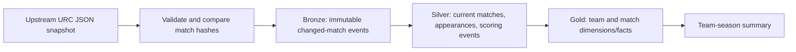

# Rugby Analytics Lakehouse

**Question:** What can match and player scoring data tell us about team performance across a United Rugby Championship season?

This portfolio project starts with a reproducible, working local pipeline for the 2024–25 rugby union season. It tracks source corrections at match level and produces team-season metrics. Airflow, Azure storage, Databricks/Delta, and dbt implementation files are included under [`cloud/`](cloud/README.md), but those components are **not yet deployed or integration tested**.

## What works now



The local reference implementation uses Python and SQLite so the incremental and correction-handling logic can be run without cloud credentials. It writes changed source records to JSONL files under `data/bronze/`, keeps an append-only event history in SQLite, and replaces affected current-state records. A repeated identical snapshot makes no changes.

## Source and scope

- Source: [transientlunatic/Rugby-Data](https://github.com/transientlunatic/Rugby-Data), `json/celtic-2024-2025.json`, fetched at run time. The upstream project describes its JSON as professional rugby union scoring data. No upstream dataset is committed here.
- Coverage: one URC season. Player analysis currently covers lineup appearances and scoring events, not tackles, carries, or full performance statistics.
- The upstream file is a **snapshot**, not an event feed. Incremental ingestion compares each match's content hash with the latest processed version. This detects late score and lineup corrections when the source is fetched again.
- The source does not publish a fixture ID in this file. The pipeline derives one from competition, season, phase, round, and both teams. A change to one of those identity fields is treated as a new fixture and needs manual reconciliation.

## Run locally

Requirements: Python 3.10+ and internet access for the first sync.

```bash
python -m pip install -e '.[dev]'
rugby-lakehouse sync
rugby-lakehouse summary
rugby-lakehouse quality
python -m pytest -q
```

For an offline input file, use `rugby-lakehouse sync --input path/to/matches.json`. Generated data stays in the ignored `data/` directory. Re-run `sync` to check for corrections; compare `changed_matches` between runs.

## Data model

| Layer | Tables / files | Purpose |
| --- | --- | --- |
| Bronze | `bronze_event`, `data/bronze/*.jsonl` | Immutable match versions with ingestion time and source hash |
| Silver | `silver_match`, `silver_player_appearance`, `silver_scoring_event` | Validated current records and flattened child entities |
| Gold | `dim_team`, `fact_match`, `gold_team_season` | Match facts and team-level season totals |

Gold computes played, wins, draws, points for, and points against from the current Silver state. These are descriptive results; the pipeline does not claim causal player-performance conclusions.

## Engineering choices and checks

- Validate required fields, distinct teams, nonnegative scores, and unique fixture keys before writing.
- Keep prior source versions in Bronze and upsert the latest version into Silver. On correction, replace the fixture's player and scoring rows, then refresh Gold in one database transaction.
- Use content hashes for idempotence. The tests exercise repeat ingestion, a late score/date correction, malformed input, and duplicate fixture keys.
- Report discrepancies between listed scoring events and final scores. These are source-quality signals, not automatic failures: event detail may be incomplete even when a final score is present.
- Use parameterized SQL and keep credentials out of the repository.

### Observed run

On 28 September 2026, the upstream 2024–25 snapshot contained 151 fixtures and 16 teams. The pipeline produced 6,946 player appearances and 2,396 scoring events. A repeated run found zero changed matches. The quality report flagged 16 fixtures where one or both teams' listed event points differed from the final score; team totals use the final scores.

## Cloud roadmap

1. Deploy the Airflow DAG to land validated snapshot envelopes in Azure storage.
2. Run the Databricks job to ingest distinct match versions into Bronze and Silver Delta tables.
3. Run and test the dbt Gold marts on Databricks SQL, then add the dbt task to the DAG.
4. Publish a small dashboard with trend and player scoring questions, then add run observability.

The local pipeline provides a testable contract for that migration. The cloud components and dashboard will be marked implemented only after they run end to end.

